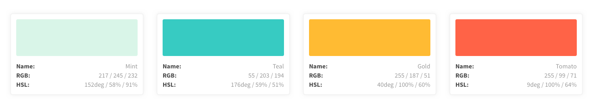

# Sass: generar una paleta de colores 



Tienes a disposición la siguiente paleta de colores:

* primary: `#d9f5e8`, nombre color Mint;
* success: `#37cbc2`, nombre color Teal;
* warning: `#ffbb33`, nombre color Gold;
* danger: `#ff6347`, nombre color Tomato;

Con los datos que se te proporciona en la paleta de colores y haciendo uso de Sass, has de:

* generar el nombre del modificador de bloque;
* mostrar a pantalla el nombre del color;
* extraer el valor RGB y HSL de cada color y mostrarlo donde corresponde;

Tienes a disposición un diseño (`paleta-colores.sketch`) y el siguiente fragmento de código HTML para generar la _card_ de cada color:

```html
<div class="card">
  <div class="card__color"></div>
  <dl class="card__details">
    <dt class="card__term">Name:</dt>
    <dd class="card__desc card__desc--name"></dd>
    <dt class="card__term">RGB:</dt>
    <dd class="card__desc card__desc--rgb"></dd>
    <dt class="card__term">HSL:</dt>
    <dd class="card__desc card__desc--hsl"></dd>
  </dl>
</div>
```
